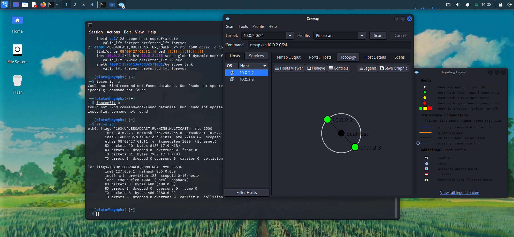
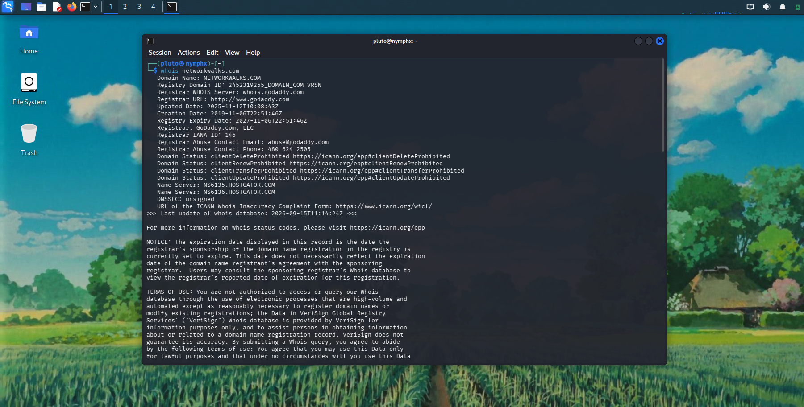
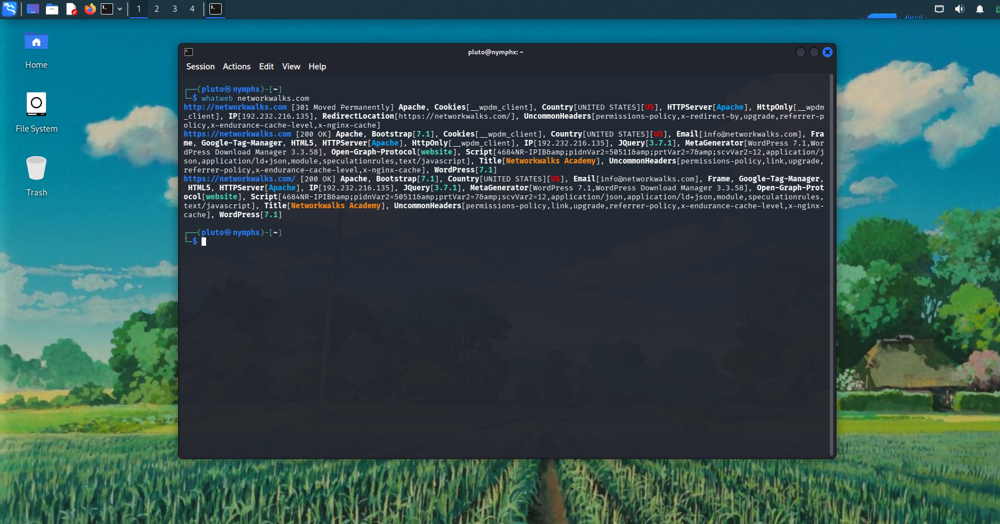
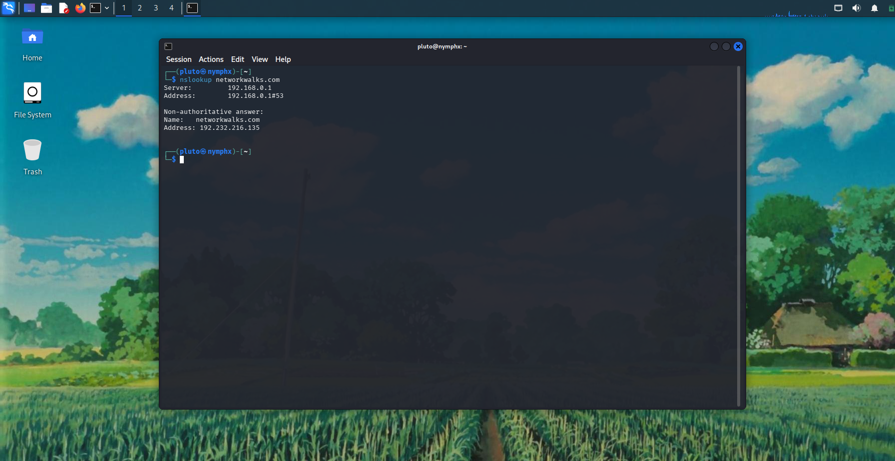
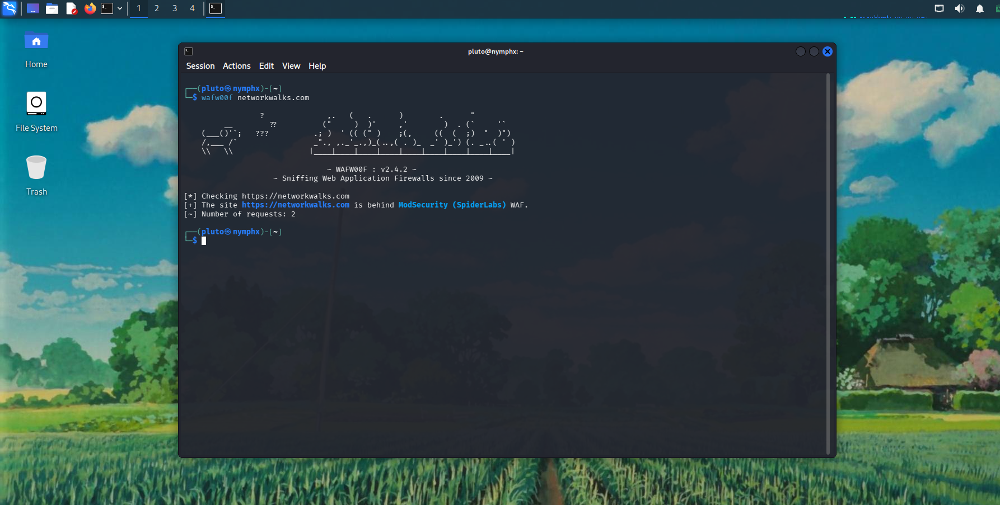
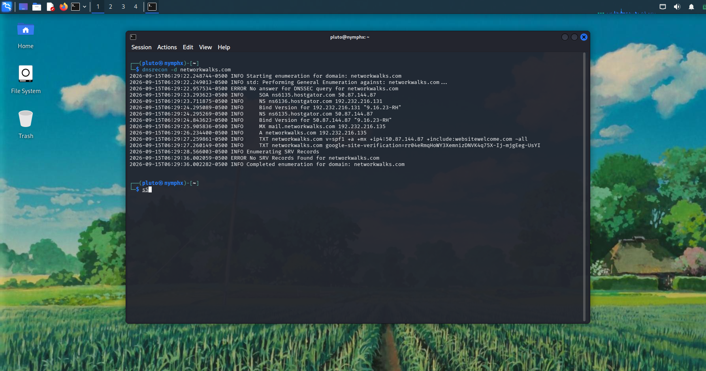

# NETWORKWALKS-B083-WK2-FOOTPRINTING-NETWORK-SCANNING

# Footprinting & Network Scanning — Kali Linux

## Project Overview

This project covers the fundamentals of **footprinting, information gathering, and network scanning** using Kali Linux.

The objective is to understand how publicly available information about a domain or network can be collected during the reconnaissance phase of a cybersecurity assessment.

The project uses various Kali Linux tools to gather information such as **domain registration details, web technologies, DNS records, HTTP headers, Web Application Firewalls, IP addresses, live hosts, MAC addresses, and network topology**.

All activities are performed within a **controlled and authorized environment** for educational and cybersecurity training purposes.

---

## Objectives

The project aims to:

- Understand the fundamentals of **footprinting and reconnaissance**.
- Gather domain registration information using `whois`.
- Identify web technologies using `whatweb`.
- Resolve domain names to IP addresses using `nslookup`.
- Inspect HTTP response headers using `curl`.
- Detect Web Application Firewalls using `wafw00f`.
- Enumerate DNS records using `dnsrecon`.
- Use **Nmap** for network discovery and scanning.
- Document the results obtained during the reconnaissance and scanning process.

---

## Purpose of the Project

The purpose of this project is to develop practical knowledge of the **reconnaissance and network discovery stages of a cybersecurity assessment**.

Footprinting allows security professionals to collect information about a target before performing further security testing. Network scanning complements this process by identifying devices and systems that are active within an authorized network.

The project provides hands-on experience with commonly used cybersecurity tools available in Kali Linux and helps build a foundation for future activities involving **network security, vulnerability assessment, ethical hacking, and penetration testing**.

---

## Technologies & Tools Used

- **Kali Linux**
- **Zenmap** — Graphical network discovery and scanning
- **Whois** — Domain registration and ownership information
- **WhatWeb** — Web technology fingerprinting
- **Nslookup** — DNS queries and IP resolution
- **cURL** — HTTP request and response-header analysis
- **Wafw00f** — Web Application Firewall detection
- **DNSRecon** — DNS record enumeration

---

# Part 1 — Footprinting

## Footprinting Overview

Footprinting is the process of collecting information about a target before performing further security testing.

The information collected during footprinting can include:

- Domain registration information
- IP addresses
- DNS records
- Web technologies
- HTTP response information
- Web Application Firewall information
- Other publicly available network details

The following Kali Linux tools were used for the footprinting exercises.

---

## Task 1 — Domain Registration Information using Whois

The `whois` command was used to obtain domain registration information.

### Command

```bash
whois <target-domain>
```

### Example

```bash
whois networkwalks.com
```

### Information Observed

The output can contain information such as:

- Domain registrar
- Registration dates
- Expiration date
- Domain status
- Name servers
- Registrar information

### Result

The `whois` command demonstrated how domain registration information can be collected during the initial reconnaissance stage.

---

## Task 2 — Web Technology Fingerprinting using WhatWeb

`WhatWeb` was used to identify technologies and services associated with a website.

### Command

```bash
whatweb <target-domain>
```

### Example

```bash
whatweb networkwalks.com
```

### Information Observed

WhatWeb can identify technologies such as:

- Web servers
- Content Management Systems
- JavaScript frameworks
- Web technologies
- HTTP headers
- Cookies
- Plugins and other web-related components

### Result

The scan provided an overview of the technologies used by the target web application.

---

## Task 3 — Domain to IP Resolution using Nslookup

`nslookup` was used to resolve a domain name to its corresponding IP address.

### Command

```bash
nslookup <target-domain>
```

### Example

```bash
nslookup networkwalks.com
```

### Information Observed

The command can provide:

- Domain name
- IPv4 address
- IPv6 address, when available
- DNS server information
- DNS resolution details

### Result

The domain was successfully resolved to its associated IP address through DNS lookup.

---

## Task 4 — HTTP Response Headers using cURL

The `curl` utility was used to send an HTTP request and inspect the response headers returned by the web server.

### Command

```bash
curl -I https://<target-domain>
```

### Example

```bash
curl -I https://networkwalks.com
```

### Information Observed

HTTP response headers can provide information such as:

- HTTP status code
- Server information
- Content type
- Cookies
- Redirect information
- Security-related headers

### Result

The HTTP response headers were examined to understand how the target web server responds to requests.

---

## Task 5 — Web Application Firewall Detection using Wafw00f

`wafw00f` was used to identify whether a Web Application Firewall (WAF) is present in front of a web application.

### Command

```bash
wafw00f <target-domain>
```

### Example

```bash
wafw00f networkwalks.com
```

### Information Observed

The tool attempts to determine:

- Whether a WAF is present
- The type or vendor of the WAF, when identifiable
- Whether the target is protected by a web application firewall

### Result

The WAF detection process provided information about the security layer protecting the web application.

---

## Task 6 — DNS Enumeration using DNSRecon

`dnsrecon` was used to enumerate DNS information associated with a domain.

### Command

```bash
dnsrecon -d <target-domain>
```

### Example

```bash
dnsrecon -d networkwalks.com
```

### Information Observed

DNSRecon can identify DNS information such as:

- A records
- AAAA records
- MX records
- NS records
- SOA records
- TXT records
- Other available DNS information

### Result

The DNS enumeration process provided a broader view of the target's DNS infrastructure.

---

# Part 2 — Network Scanning with Zenmap

## Network Scanning Overview

The network scanning portion of this project was performed using **Zenmap**, the graphical user interface for Nmap.

Zenmap provides a graphical interface for configuring scans, viewing discovered hosts, examining network information, and saving scan results. The practical exercise focused on discovering systems within the authorized laboratory network and documenting the resulting network topology.

The scanning activities were performed against the **private virtual network created for the cybersecurity laboratory**.

---

## Zenmap Output

The following information was obtained from the Zenmap network scan:

- Local IP address and LAN subnet
- List of live hosts within the subnet
- Total number of live hosts
- IP addresses of discovered hosts
- MAC addresses of hosts where available
- Network topology generated from the scan
- Saved scan output in PDF format

The actual scan results and screenshots will be added to the repository as evidence of the completed practical exercise.

### Zenmap Scan



### Saved PDF Output

The generated network topology and scan output were saved in PDF format for documentation.

---

# Network Scanning Workflow

The overall network scanning process followed these steps:

```text
Identify Local IP
       ↓
Identify Subnet
       ↓
Perform Host Discovery
       ↓
Identify Live Hosts
       ↓
Record IP Addresses
       ↓
Identify MAC Addresses
       ↓
Save Scan Results
       ↓
Document Network Topology
```

---

# Footprinting Workflow

The footprinting process followed this sequence:

```text
Domain
  ↓
Whois
  ↓
Domain Registration Information
  ↓
WhatWeb
  ↓
Web Technology Identification
  ↓
Nslookup
  ↓
IP Address Resolution
  ↓
cURL
  ↓
HTTP Header Analysis
  ↓
Wafw00f
  ↓
WAF Detection
  ↓
DNSRecon
  ↓
DNS Record Enumeration
```

---

# Commands Used

## Footprinting Commands

### Whois

```bash
whois <target-domain>
```

### WhatWeb

```bash
whatweb <target-domain>
```

### Nslookup

```bash
nslookup <target-domain>
```

### cURL

```bash
curl -I https://<target-domain>
```

### Wafw00f

```bash
wafw00f <target-domain>
```

### DNSRecon

```bash
dnsrecon -d <target-domain>
```

---

## Network Scanning with Zenmap

Zenmap was used as the graphical interface for the network discovery and scanning exercise. The resulting host information and network topology were reviewed and saved as part of the practical documentation.

---

# Results & Observations

The practical exercises provided experience in collecting information from both **domain-level and network-level sources**.

## Footprinting

The footprinting exercises demonstrated how different tools can provide different types of information about a domain:

| Tool | Purpose |
|---|---|
| `whois` | Domain registration information |
| `whatweb` | Web technology fingerprinting |
| `nslookup` | DNS and IP resolution |
| `curl` | HTTP response-header analysis |
| `wafw00f` | WAF detection |
| `dnsrecon` | DNS record enumeration |

## Network Scanning

Zenmap was used to:

- Identify the local network range.
- Discover active hosts.
- Determine the number of live hosts.
- Record IP addresses.
- Identify MAC addresses where available.
- Save network discovery results for documentation.

---

# Lab Screenshots

Screenshots documenting the practical work will be added to this section.

## Footprinting

### Whois



### WhatWeb



### Nslookup


### cURL



### Wafw00f



### DNSRecon



---

# What I Learned

This project provided practical experience with the reconnaissance and network discovery stages of a cybersecurity assessment.

### 1. Footprinting

I learned how publicly available information can be collected about a target before performing further security testing.

### 2. Domain Information Gathering

Using `whois`, I learned how domain registration information and DNS-related details can be examined during reconnaissance.

### 3. Web Technology Fingerprinting

Using WhatWeb, I learned how to identify technologies and components associated with a web application.

### 4. DNS Enumeration

Using `nslookup` and DNSRecon, I learned how DNS can be queried to identify domain records, name servers, mail servers, IP addresses, and other available information.

### 5. HTTP Header Analysis

Using cURL, I learned how HTTP response headers can provide useful information about how a web server responds to requests.

### 6. WAF Detection

Using Wafw00f, I learned how security researchers can identify the presence of a Web Application Firewall protecting a web application.

### 7. Network Discovery

Using Zenmap, I learned how graphical network scanning can be used to identify active systems within an authorized network and determine their IP addresses.

### 8. Network Topology

The scanning process helped me understand how devices within a network can be identified and represented as part of a basic network topology.

---

# Security & Ethical Use

All footprinting and network scanning activities in this project are intended for **educational purposes and authorized security testing only**.

Network scanning or reconnaissance against systems without permission may violate organizational policies, laws, or regulations.

The Nmap activities described in this project should only be performed against **networks and systems that you own or have explicit authorization to test**.

---

# Tools & Resources

- **Kali Linux:** https://www.kali.org/
- **Nmap / Zenmap:** https://nmap.org/zenmap/
- **Whois:** https://www.whois.com/
- **WhatWeb:** https://github.com/urbanadventurer/WhatWeb
- **Wafw00f:** https://github.com/EnableSecurity/wafw00f
- **DNSRecon:** https://github.com/darkoperator/dnsrecon
- **cURL:** https://curl.se/

---

# Author

*Aditya Choubey*  
**Computer Science Student**

[LinkedIn](https://www.linkedin.com/in/adityachby/)

---

## Project Information

**Program Name:** Cybersecurity at Networkwalks  
**Week:** 02  
**Project:** Footprinting & Network Scanning  
**Platform:** Kali Linux  
**Repository:** GitHub
